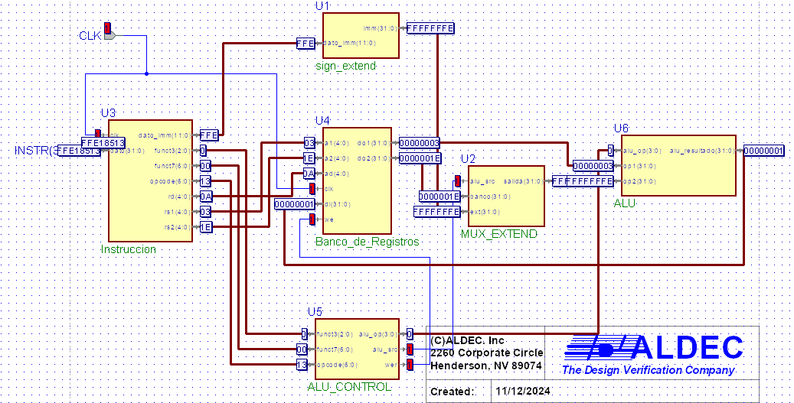

# BancoDeRegistros
Este es un proyecto para la materia de "Arquitectura de Computadoras" que esta en proceso de implementacion

### Actualizaciones
- Mejora de ext de signo
- Renombrar variables y esquematicos para mejor entendimiento
### Esquematico

---

### Notas
En esta implementacion se construyo las instrucciones inmediatas. Las cuales se operan mediante una un valor y un registro.
Este proceso se realiza las operaciones y se guarda en el banco de registros.

---

### Tabla de registros y pruebas para esta implementacion

control 7bits
números 5
        5
confun  3
direciion 00011 5
op 0110011 7

INSTRUCCION
	inm		 |
fun7   | rs2 | rs1 |fun3| rd | opcode
0000000 00010 00011 000 01010 0010011 inm:2  rs1:3
0000000 11110 00011 000 01010 0010011 imn:-2 rs1:3 

CONCATENADO
00000000001000011000010100010011
11111111111000011000010100010011 